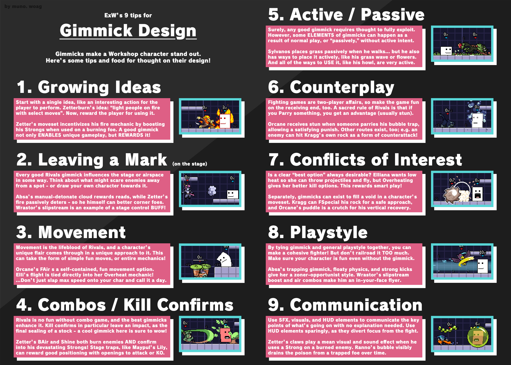

# Gimmick and Specials

## Gimmick

A character's gimmick is often the best opportunity to reinforce their [identity](identity.md). Use the central mechanic
to encourage and facilitate the kind of play you want.

If you want a character who wants to stay very close to their opponent, you could reward that behavior with some kind of
aura effect, or facilitate it with an approach tool. That being said, a gimmick shouldn't be a script. It shouldn't feel
like there is only one possible style of play.

::: quote

For Character Concepts I would really try to capture a character's "Central Mechanic."

Characters from smash and other games mish mash a moveset that best captures that character in the image of their
original game.

Rivals of Aether characters have a synergistic mechanic that ties a lot of their moves together.

Orcane Puddle, Eliana Steam, Etalus Ice, Zetterburn Burn, Kaboom Fuse.

It sounds pretty simple, but you'll be amazed at how many characters lack a central mechanic.

~ PANDABOMB
:::

#### Setup and Payoff

Many gimmicks can be seen as setups and payoffs. Setup options may not be powerful on their own, but enable payoffs.
Payoffs may be unavailable or unimpressive normally, but become much stronger with setup.

- Zetterburn fire attacks set up strongs
- Absa clouds set up traps or stun into sweet spot punishes.
- Ranno poison sets up long bubbles

::: quote 

The primary goals in a match of RoA is to deal damage to enemies and knock them off the screen, but it's
always fun to add "sub objectives" that help the character fulfill the primary goals of the game.

~ PANDABOMB
:::

#### Stage Control

::: construction

todo

:::

#### Resource

::: construction

todo ask mawral about why resource gimmicks are rare in the base cast.

:::

Further Resources

### Specials

::: construction

todo

:::